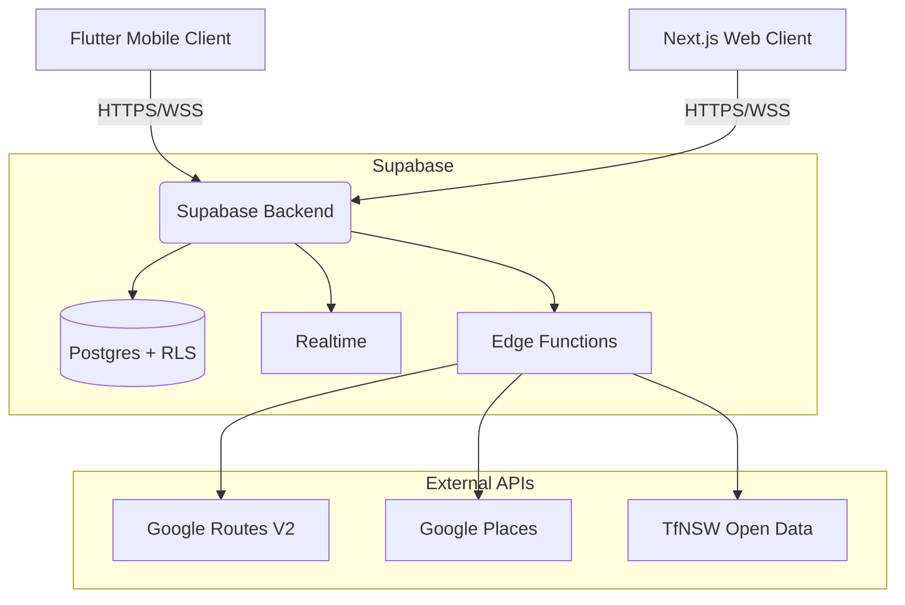

# MQ Navigation

A production-ready cross-platform mobile client for Macquarie University's campus navigation platform, built with Flutter. Part of a **two frontends, one backend** architecture sharing a Supabase backend with the Next.js web application.

## System Architecture



## Features

### 🚀 Functional
- **Home Hub**: MQ shield hero branding, real-time "Metro Countdown" card (via TfNSW proxy), and bento-grid Quick Access for Student Services, Faculty, Parking, Campus Hub, and Food.
- **Unified Campus Map**: Dual-renderer support (Google Maps & Raster Overlay) with shared state.
- **Campus Routing**: 153-building registry with server-side routing via Supabase Edge Functions.
- **Transit Integration**: Live metro/train/bus departure tracking from Macquarie University Station.
- **Notification Inbox**: Supabase-backed persistent notifications and local study-prompt scheduling.
- **Security**: Biometric app lock (local_auth) and secure credential storage.

### 🗺️ Roadmap
- **Gamification**: XP and Streaks logic (Domain models present, UI pending).
- **Popular Destinations**: Data-driven carousel for trending campus spots.
- **Accessibility Audit**: Full WCAG 2.2 compliance for vision-impaired navigation.

## Tech Stack (2026 Standards)

| Layer | Technology |
|-------|-----------|
| **Framework** | Flutter 3.11+ (Stable) |
| **State** | Riverpod 3.2 (AsyncNotifier) |
| **Routing** | GoRouter 17.1 (StatefulShellRoute) |
| **Maps** | google_maps_flutter 2.15 / flutter_map 7.0 |
| **Backend** | Supabase (RLS + Deno Edge Functions) |

## Quality Gate

All contributions must pass the automated quality gate:

```bash
./scripts/check.sh --quick
```

- **Tests**: 154 unit and widget tests (100% pass required).
- **Lints**: Strict adherence to `analysis_options.yaml`.
- **i18n**: 35 locales supported (RTL compliant).

## License
Licensed under the MIT License.
