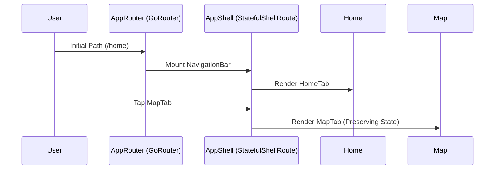

# MQ Navigation: Technical Architecture (2026)

## Overview
The application follows a **Feature-First Clean Architecture** pattern, designed for high-concurrency campus navigation and real-time transit data.

## Layering Strategy

### 1. Presentation Layer (Riverpod)
Uses `AsyncNotifier` to manage complex asynchronous states (Map, Auth, Notifications).
- **Controllers**: `MapController`, `SettingsController`, `NotificationsController`.
- **Widgets**: Atomic design system components (`MqButton`, `MqCard`) and feature-specific views.

### 2. Domain Layer (Pure Dart)
Contains enterprise business logic and entities.
- **Entities**: `Building`, `MapRoute`, `AppNotification`, `UserPreferences`.
- **Services**: `GeoUtils`, `NotificationScheduler`.

### 3. Data Layer (Infrastructure)
Concrete implementations of data access.
- **Repositories**: `MapRepositoryImpl`, `SettingsRepository`.
- **Data Sources**: `MapsRoutesRemoteSource` (HTTPS), `SecureStorageService` (Native Keychain).

## Navigation & Routing

## Mapping Standards (2026)
The app implements the **Dual-Renderer Pattern**:
- **Native Render**: `google_maps_flutter` using `mapId` for 2026 cloud-styling.
- **Campus Render**: `flutter_map` with `CrsSimple` projection for custom raster overlays calibrated to university GPS coordinates.
